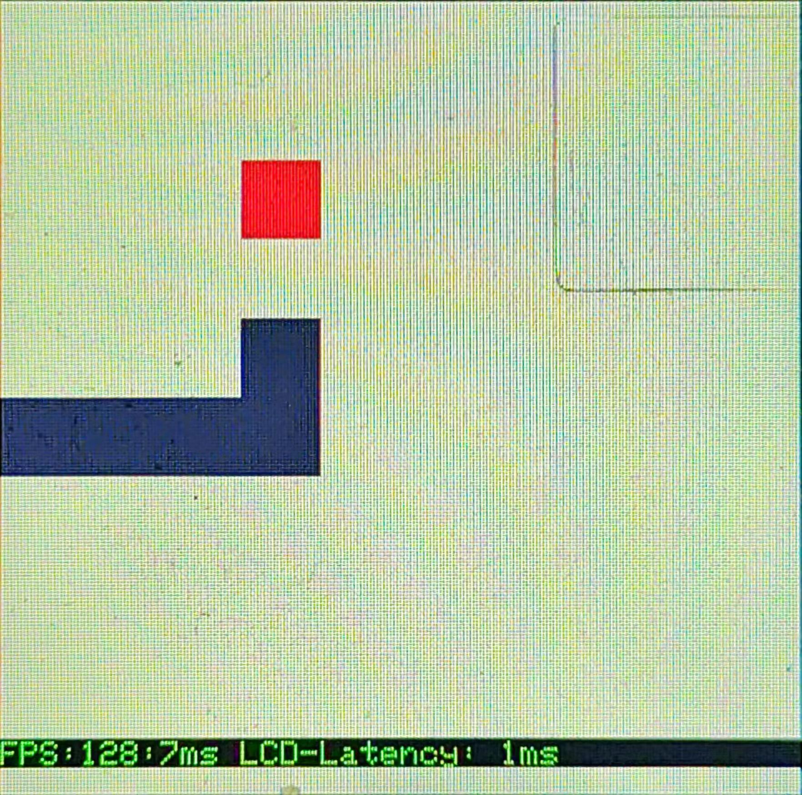

# TinySquare

[中文页](./docs/README_cn.md)

## 1. Introduction

TinySquare is an embedded block game engine designed to provide a lightweight game development solution for devices targeting Cortex-M processors. TinySquare's design principles are small code size and lightweight running costs to ensure that the engine can run efficiently on resource-constrained embedded devices. TinySquare has the following features and advantages:

- Layer rendering uses the Arm-2d library as the underlying support, which is specifically optimized for the Cortex-M processor. By fully utilizing the characteristics of the Cortex-M processor, the engine can provide efficient performance and optimized gaming experience.
- In order to meet the resource constraints of embedded systems, TinySquare focused on the small code size of the engine and the lightweight running environment during the development process. During the running process, dynamic dirty matrix refresh technology was used, and only one partial frame buffer was needed to refresh. All layers greatly save RAM overhead during runtime to ensure that the performance and functionality of the engine can be balanced under limited resources.
- TinySquare focuses on block game types. Whether it is classic games like Snake, Tetris, or other innovative block-based gameplay, the engine provides highly customized configuration items for layers to support game development and customization.
- TinySquare focuses on lightweight design, while also having a certain degree of flexibility and high configurability. The engine provides a concise and powerful set of APIs: only 24 C APIs and only 18 Python APIs. A rich set of configurable options allows developers to customize according to their needs to create a unique and satisfying gaming experience.
- TinySquare code writing and API naming follow RT-Thread coding standards. The development process follows the principle of minimum information disclosure. In theory, developers using TinySquare only need to pay attention to the API documentation to quickly get started with TinySquare development.

Using a minimally functional Snake as a reference, the space overhead and performance of TinySquare are given. Note that this use case does not use the Python virtual machine:

  

<table>
  <tr>
    <th colspan="5"> Reference data </th>
  </tr>
  <tr>
    <th colspan="2"></th>
    <th> -Os optimization </th>
    <th> -Oz optimization </th>
    <th> Remark </th>
  </tr>
  <tr>
    <th rowspan="7"> Configuration </th>
    <th> Main frequency </th>
    <td style="text-align:center"> 80MHz </td>
    <td style="text-align:center"> 80MHz </td>
    <td style="text-align:center"> —— </td>
  </tr>
  <tr>
    <th> Optimization level </th>
    <td style="text-align:center"> -Os -lto </td>
    <td style="text-align:center"> -Oz -lto </td>
    <td style="text-align:center"> —— </td>
  </tr>
  <tr>
    <th> Screen </th>
    <td style="text-align:center"> 240 * 240 </td>
    <td style="text-align:center"> 240 * 240 </td>
    <td style="text-align:center"> —— </td>
  </tr>
  <tr>
    <th> PFB </th>
    <td style="text-align:center"> 240 * 4 </td>
    <td style="text-align:center"> 240 * 4 </td>
    <td style="text-align:center"> —— </td>
  </tr>
  <tr>
    <th> Heap </th>
    <td style="text-align:center"> 0x100 </td>
    <td style="text-align:center"> 0x100 </td>
    <td style="text-align:center"> —— </td>
  </tr>
  <tr>
    <th> Stack </th>
    <td style="text-align:center"> 0x100 </td>
    <td style="text-align:center"> 0x100 </td>
    <td style="text-align:center"> —— </td>
  </tr>
  <tr>
    <th> rt heap </th>
    <td style="text-align:center"> 0x2400 </td>
    <td style="text-align:center"> 0x2400 </td>
    <td style="text-align:center"> —— </td>
  </tr>
  <tr>
    <th> Performance </th>
    <th> FPS </th>
    <td style="text-align:center"> 140:7ms </td>
    <td style="text-align:center"> 128:7ms </td>
    <td style="text-align:center"> —— </td>
  </tr>
  <tr>
    <th rowspan="4"> Program size </th>
    <th> Code </th>
    <td style="text-align:center"> 34156 </td>
    <td style="text-align:center"> 29688 </td>
    <td style="text-align:center"> —— </td>
  </tr>
  <tr>
    <th> RO-data </th>
    <td style="text-align:center"> 2520 </td>
    <td style="text-align:center"> 2512 </td>
    <td style="text-align:center"> —— </td>
  </tr>
  <tr>
    <th> RW-data </th>
    <td style="text-align:center"> 180 </td>
    <td style="text-align:center"> 180 </td>
    <td style="text-align:center"> —— </td>
  </tr>
  <tr>
    <th> ZI-data </th>
    <td style="text-align:center"> 16052 </td>
    <td style="text-align:center"> 16052 </td>
    <td style="text-align:center"> Including LCD buffer, PFB pool, rt heap, rt stack, stack, heap, snake resource, etc. </td>
  </tr>
</table>

Combining the above data, it is not difficult to conclude that the engine itself takes up very little resources, and the corresponding performance is also very powerful! The embedded world simply doesn't need 128 or even 140 FPS. Therefore, the above data can be further optimized, the size of the PFB can be further reduced, and the task stacks of engine tasks and game tasks are also very rich in the current test environment, and can be further compressed to reduce the rt heap size.
To sum up, TinySquare meets the design principle of "small code size and lightweight running cost", while also showing excellent performance.

### 1.1 Contents

| Name | Description |
| ---- | ---- |
| docs | Document directory |
| examples | examples directory |
| library | dependent library directory |
| port | ported code directory |
| source | source code directory |

### 1.2 License

TinySquare is licensed under the Apache-2.0 license, see the `LICENSE` file for details.

### 1.3 Dependence

- Arm-2D v1.1.5
- RT-Thread
- pikaPython

## 2. How to port TinySquare

- [C library porting](./docs/guide_with_c_en.md)
- [pikaPython library porting](./docs/guide_with_pikaPython_en.md)

## 3. How to use TinySquare

- [C library usage - Tetris](./docs/example_tetris_en.md)
- [pikaPython library usage - Snake](./docs/example_snake_en.md)
- [API](./docs/api_en.md)

## 4. Notice

- [Notice](./docs/notice_en.md)

## 5. Contact & Thanks

* Maintainer: [AlgoOy](https://github.com/AlgoOy)
* Home page: https://github.com/AlgoOy/TinySquare
* Thanks: [GorgonMeducer](https://github.com/GorgonMeducer)