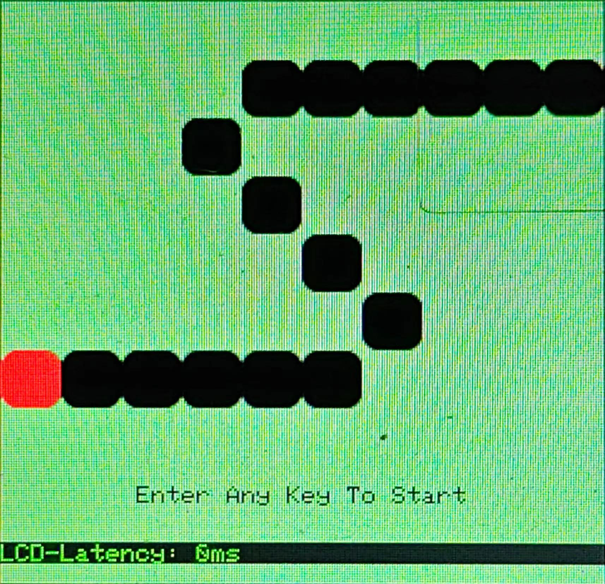
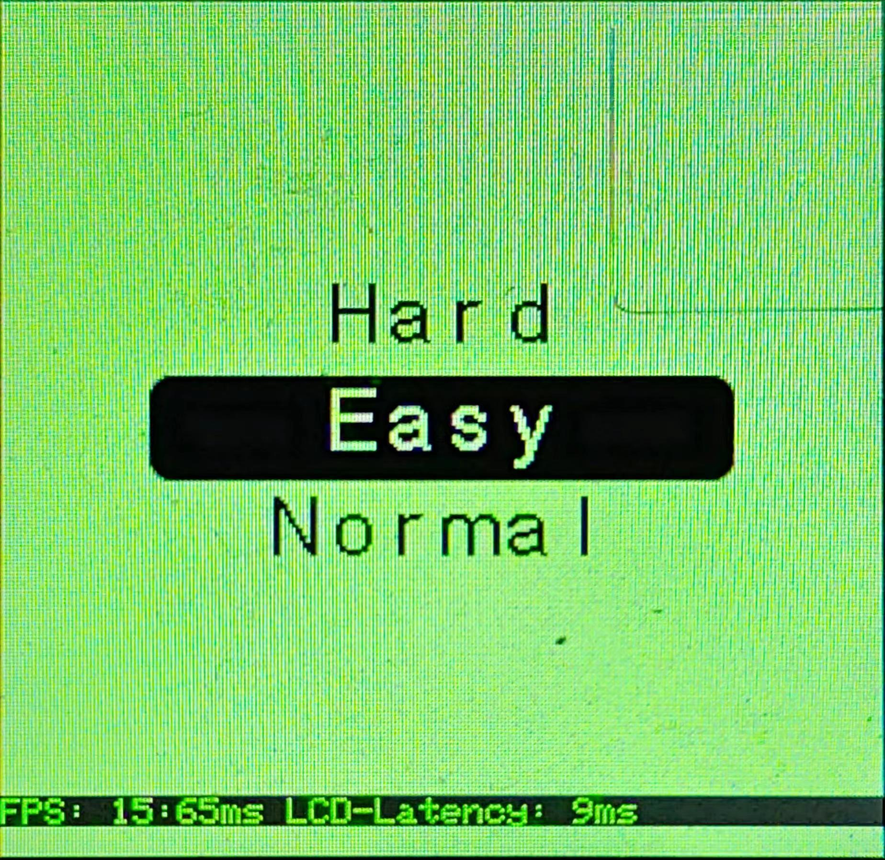
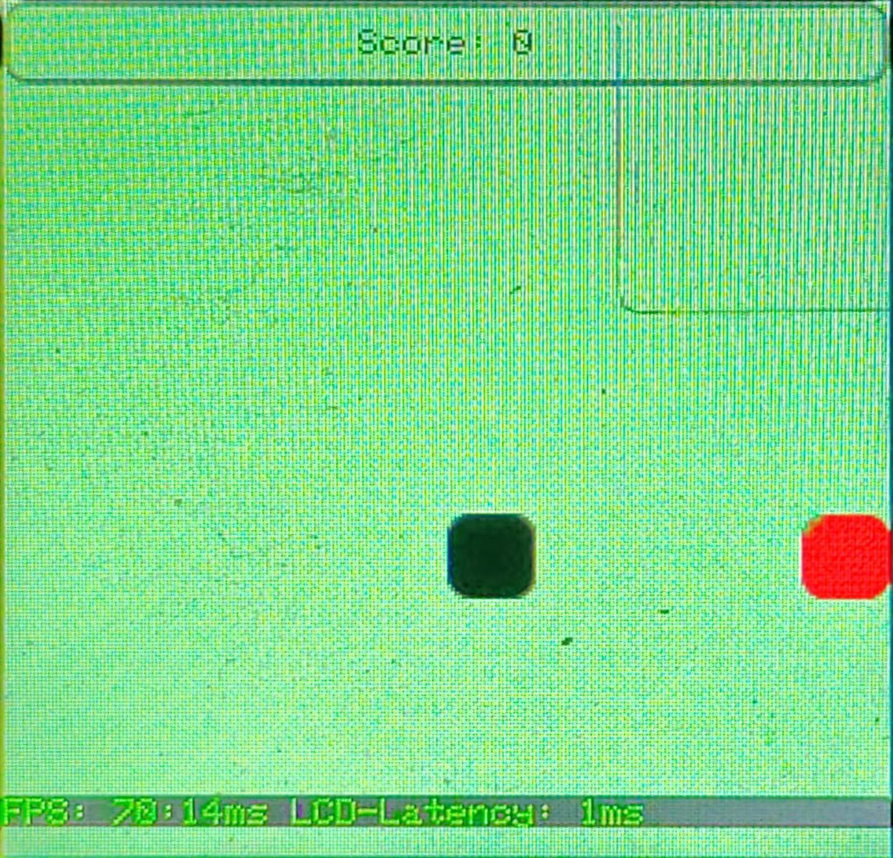

# pikaPython 库使用 - 贪吃蛇

- [pikaPython 库使用 - 贪吃蛇](#pikapython-库使用---贪吃蛇)
  - [贪吃蛇](#贪吃蛇)
    - [效果图](#效果图)
    - [参考数据](#参考数据)
      - [1/100 PFB](#1100-pfb)
      - [100/100 PFB](#100100-pfb)
    - [代码分析](#代码分析)

## 贪吃蛇

以 snake 游戏为例，介绍一下在 Python 语言运行环境下，如何实现一个多 stage 的 snake 游戏

### 效果图

- 启动界面
  - 

- 难度选择
  - 

- 游戏界面
  - 

### 参考数据

#### 1/100 PFB

- 配置
  - 主频：80MHz
  - 优化等级：-Os -lto
  - 屏幕：240 * 240
  - PFB：24 * 24
  - 堆：0x6800
  - 栈：0x200

- 性能
  - 启动界面：无刷新操作
  - 难度选择：
    - 固定刷新区域：160 * 90
    - FPS： 15：65ms
  - 游戏界面：
    - FPS： 69：14ms

- 程序大小
  - Code=150648
  - RO-data=49400
  - RW-data=732
  - ZI-data=58500

#### 100/100 PFB

- 配置
  - 主频：80MHz
  - 优化等级：-Os -lto
  - 屏幕：240 * 240
  - PFB：240 * 240
  - 堆：0x6800
  - 栈：0x200

- 性能
  - 启动界面：无刷新操作
  - 难度选择：
    - 固定刷新区域：160 * 90
    - FPS： 52：18ms
  - 游戏界面：
    - FPS： 131：7ms

- 程序大小
  - Code=150648
  - RO-data=49400
  - RW-data=732
  - ZI-data=172548

### 代码分析

snake 游戏的源代码位于 pikascript 下的 snake.py。在 Python 运行环境下，可用的图层有：背景颜色图层、基本单元图层、用户单元图层、文本图层、菜单图层、数字列表图层。相对于 C 环境下，少了背景图层，同时，自定义程度相对降低

- 首先，需要初始化事件控制和图像控制
    ```python
    self.evt = TinySquare.EvtKey()
    self.gfx = TinySquare.Gfx()
    ```

- 通过 stage 类来初始化一个 stage，并通过 `register_layer` 方法来注册图层到 stage 中
    ```python
    welcome_stage = TinySquare.Stage()
    welcome_stage.register_layer(TinySquare.LayerBGCL(TinySquare.BG_CL_NORMAL, self.bg_color, 255, self.screen_region, None, None))
    ```

- 用户图层类的初始化也相对来说非常简单，只需要指定宽和高的数量即可，用户图层类的自定义绘制功能，需要一定的 C 语言基础才可以完成。调用 `draw_userMap` 即可完成对用户图层的绘制
    ```python
    welcome_user_layer = TinySquare.LayerUser(self.width_block, self.height_block)
    welcome_stage.register_layer(welcome_user_layer)
    welcome_user_layer.draw_userMap(1, 1, 1)
    ```

- 文本图层类的初始化与 C 环境下类似，指定字体、颜色、不透明度以及 Region 即可。文本采用类 C 语言的格式化输出
    ```python
    welcome_text_layer = TinySquare.LayerText(TinySquare.TEXT_FONT_6X8,
                                                    self.txt_color,
                                                    255,
                                                    TinySquare.Region(0, 192, 240, 24))
    welcome_stage.register_layer(welcome_text_layer)
    welcome_text_layer.print_str("%s", "Enter Any Key To Start")
    ```

- 当进行 stage 切换时，只需要定义一个 stage 类实例，然后进行切换即可，并可根据实际情况进行刷新操作
    ```python
    setting_stage = TinySquare.Stage()
    self.gfx.switch_stage()
    self.gfx.refresh()
    ```

- 菜单图层类的自定义选项相对于 C 语言大幅减少，但更加易用
    ```python
    setting_menu_layer = TinySquare.LayerMenu(("Easy", "Normal", "Hard"),
                                                    TinySquare.TEXT_FONT_16X24,
                                                    160,
                                                    30,
                                                    TinySquare.ItemFormat(self.bg_color, self.txt_color, 255),
                                                    TinySquare.ItemFormat(self.txt_color, self.bg_color, 255))
    setting_stage.register_layer(setting_menu_layer)
    self.gfx.refresh()
    menu_idx = setting_menu_layer.get_idx()
    ```

- TinySquare 的使用非常简洁易上手，以上基本上涵盖了 TinySquare 在 python 运行环境下的基础功能，更多请查看 API 文档