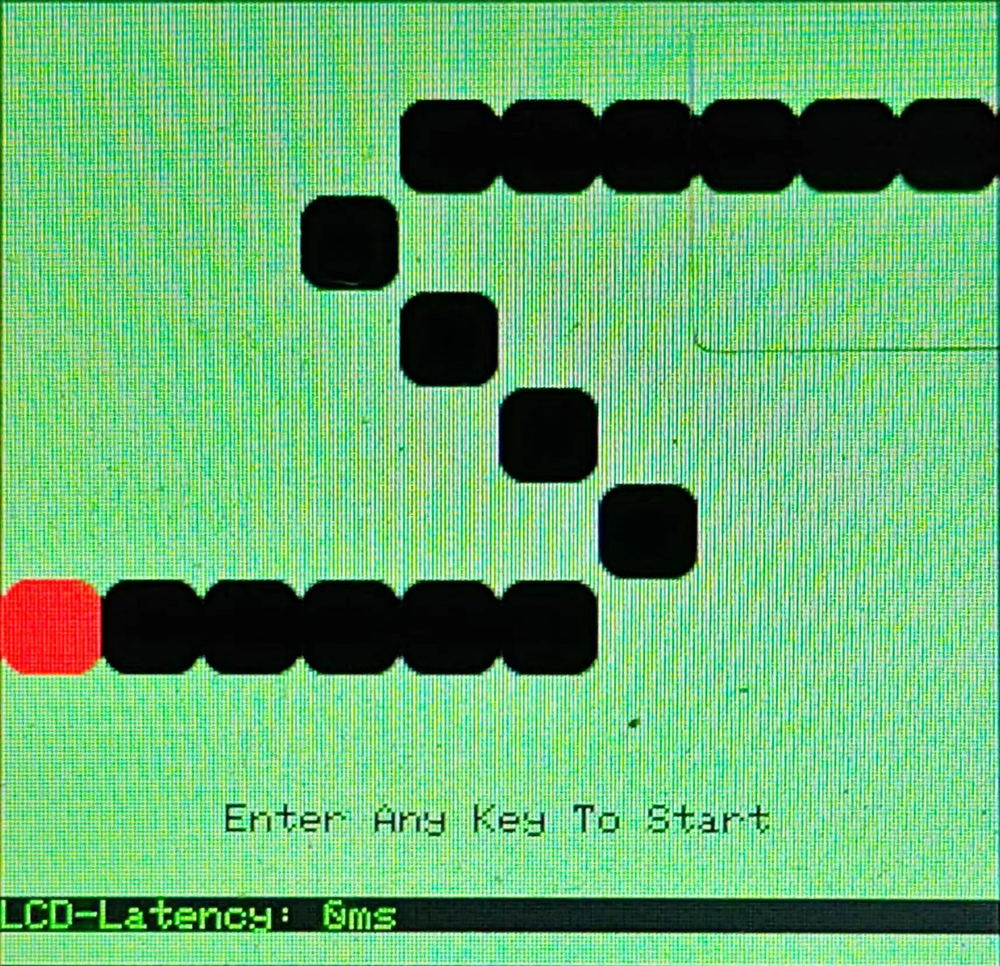
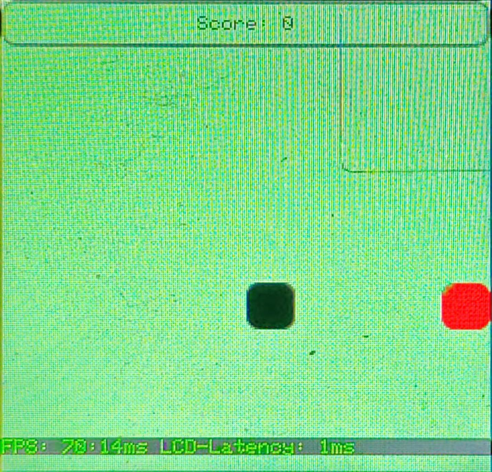

# pikaPython library usage - Snake

- [pikaPython library usage - Snake](#pikapython-library-usage---snake)
  - [Greedy Snake](#greedy-snake)
    - [Renderings](#renderings)
    - [Reference data](#reference-data)
      - [1/100 PFB](#1100-pfb)
      - [100/100 PFB](#100100-pfb)
    - [Code analysis](#code-analysis)

## Greedy Snake

Taking the snake game as an example, we will introduce how to implement a multi-stage snake game in the Python language running environment.

### Renderings

- Start interface
   - 

- Difficulty selection
   - 

- game interface
   - 

### Reference data

#### 1/100 PFB

- Configuration
   - Main frequency: 80MHz
   - Optimization level: -Os -lto
   - Screen: 240*240
   -PFB: 24*24
   - Heap: 0x6800
   - Stack: 0x200

- Performance
   - Startup interface: no refresh operation
   - Difficulty selection:
     - Fixed refresh area: 160*90
     - FPS: 15:65ms
   - game interface:
     - FPS: 69:14ms

- Program size
   - Code=150648
   -RO-data=49400
   - RW-data=732
   -ZI-data=58500

#### 100/100 PFB

- Configuration
   - Main frequency: 80MHz
   - Optimization level: -Os -lto
   - Screen: 240*240
   -PFB: 240*240
   - Heap: 0x6800
   - Stack: 0x200

- Performance
   - Startup interface: no refresh operation
   - Difficulty selection:
     - Fixed refresh area: 160*90
     - FPS: 52:18ms
   - game interface:
     - FPS: 131:7ms

- Program size
   - Code=150648
   -RO-data=49400
   - RW-data=732
   - ZI-data=172548

### Code analysis

The source code for the snake game is located in snake.py under pikascript. In the Python running environment, the available layers are: background color layer, basic unit layer, user unit layer, text layer, menu layer, and number list layer. Compared with the C environment, there is no background layer, and at the same time, the degree of customization is relatively reduced.

- First, event control and image control need to be initialized
     ```python
     self.evt = TinySquare.EvtKey()
     self.gfx = TinySquare.Gfx()
     ```

- Initialize a stage through the stage class, and register the layer into the stage through the `register_layer` method
     ```python
     welcome_stage = TinySquare.Stage()
     welcome_stage.register_layer(TinySquare.LayerBGCL(TinySquare.BG_CL_NORMAL, self.bg_color, 255, self.screen_region, None, None))
     ```

- The initialization of the user layer class is relatively simple. You only need to specify the width and height. The custom drawing function of the user layer class requires a certain C language foundation to complete. Call `draw_userMap` to complete drawing of the user layer
     ```python
     welcome_user_layer = TinySquare.LayerUser(self.width_block, self.height_block)
     welcome_stage.register_layer(welcome_user_layer)
     welcome_user_layer.draw_userMap(1, 1, 1)
     ```

- The initialization of the text layer class is similar to that in the C environment, just specify the font, color, opacity and Region. The text is formatted in a C-like language.
     ```python
     welcome_text_layer = TinySquare.LayerText(TinySquare.TEXT_FONT_6X8,
                                                     self.txt_color,
                                                     255,
                                                     TinySquare.Region(0, 192, 240, 24))
     welcome_stage.register_layer(welcome_text_layer)
     welcome_text_layer.print_str("%s", "Enter Any Key To Start")
     ```

- When switching stages, you only need to define a stage class instance and then switch, and refresh operations can be performed according to the actual situation.
     ```python
     setting_stage = TinySquare.Stage()
     self.gfx.switch_stage()
     self.gfx.refresh()
     ```

- The customization options of the menu layer class are greatly reduced compared to the C language, but they are easier to use.
     ```python
     setting_menu_layer = TinySquare.LayerMenu(("Easy", "Normal", "Hard"),
                                                     TinySquare.TEXT_FONT_16X24,
                                                     160,
                                                     30,
                                                     TinySquare.ItemFormat(self.bg_color, self.txt_color, 255),
                                                     TinySquare.ItemFormat(self.txt_color, self.bg_color, 255))
     setting_stage.register_layer(setting_menu_layer)
     self.gfx.refresh()
     menu_idx = setting_menu_layer.get_idx()
     ```

- The use of TinySquare is very simple and easy to use. The above basically covers the basic functions of TinySquare in the python operating environment. For more information, please check the API documentation