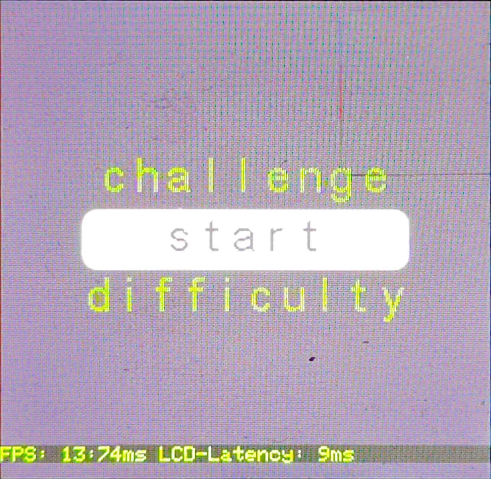
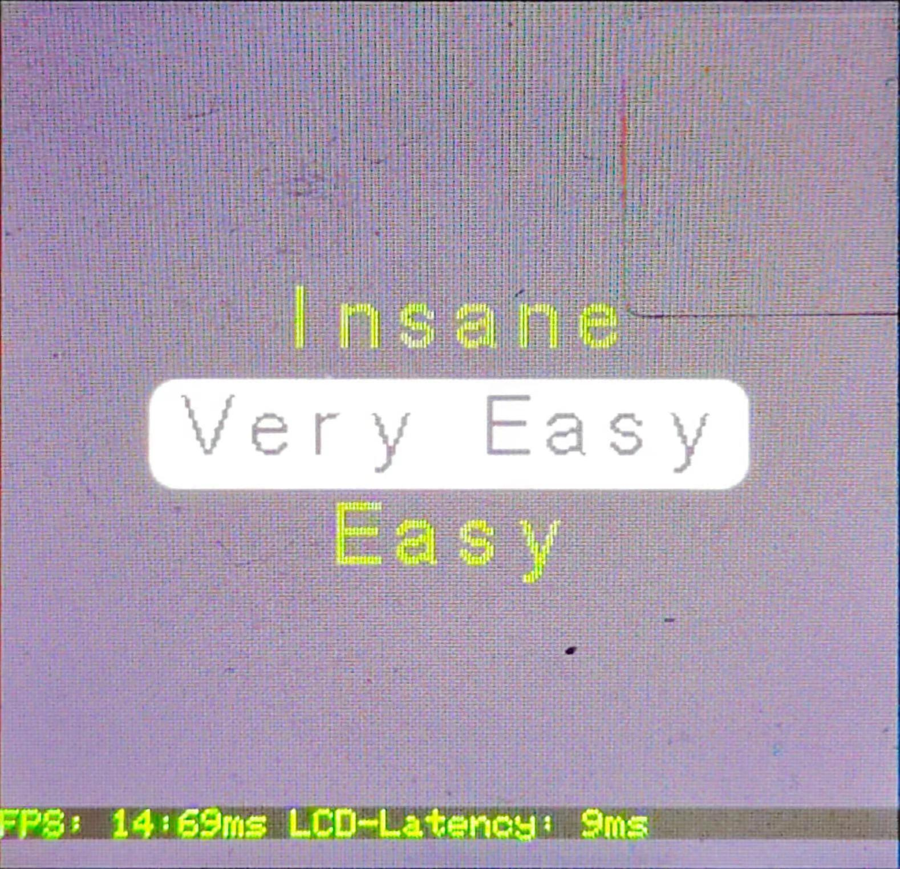
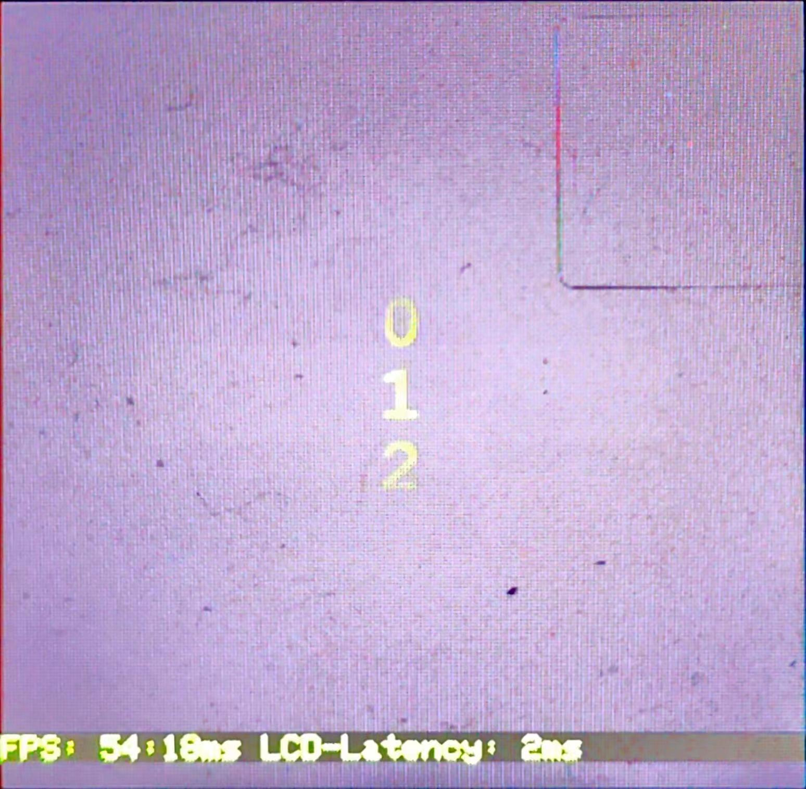
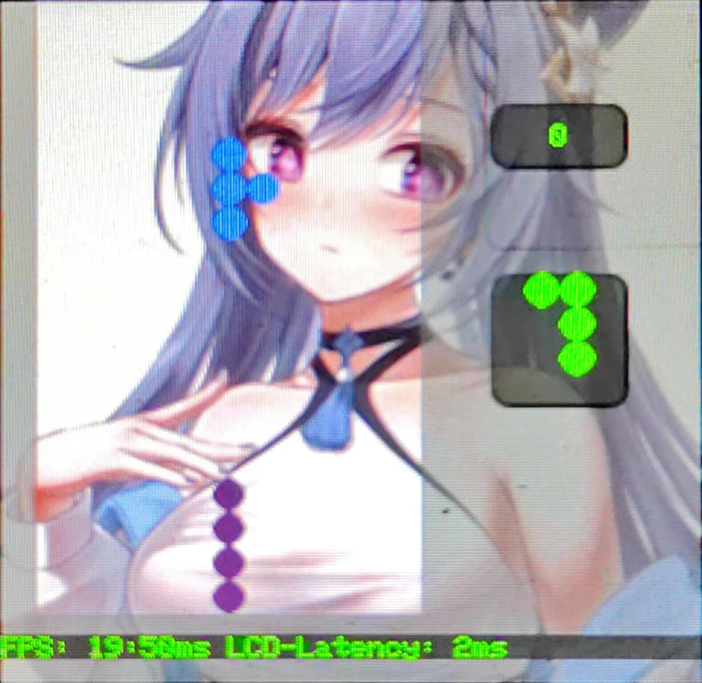

# C 库使用 - 俄罗斯方块

- [C 库使用 - 俄罗斯方块](#c-库使用---俄罗斯方块)
  - [俄罗斯方块](#俄罗斯方块)
    - [效果图](#效果图)
    - [参考数据](#参考数据)
    - [代码分析](#代码分析)

## 俄罗斯方块

以 tetris 游戏为例，介绍一下在 C 语言运行环境下，如何实现一个多 stage 的 tetris 游戏

### 效果图

- 启动界面
  - <div align="center">  </div>

- 难度选择
  - <div align="center">  </div>

- 挑战级别
  - <div align="center">  </div>

- 游戏界面
  - <div align="center">  </div>

### 参考数据

<table>
  <tr>
    <th colspan="5"> 参考数据 </th>
  </tr>
  <tr>
    <th colspan="2"></th>
    <th> -Os 优化 </th>
    <th> -Oz 优化 </th>
    <th> 备注 </th>
  </tr>
  <tr>
    <th rowspan="7"> 配置 </th>
    <th> 主频 </th>
    <td style="text-align:center"> 80MHz </td>
    <td style="text-align:center"> 80MHz </td>
    <td style="text-align:center"> —— </td>
  </tr>
  <tr>
    <th> 优化等级 </th>
    <td style="text-align:center"> -Os -lto </td>
    <td style="text-align:center"> -Oz -lto </td>
    <td style="text-align:center"> —— </td>
  </tr>
  <tr>
    <th> 屏幕尺寸 </th>
    <td style="text-align:center"> 240 * 240 </td>
    <td style="text-align:center"> 240 * 240 </td>
    <td style="text-align:center"> —— </td>
  </tr>
  <tr>
    <th> PFB 尺寸 </th>
    <td style="text-align:center"> 240 * 4 </td>
    <td style="text-align:center"> 240 * 4 </td>
    <td style="text-align:center"> —— </td>
  </tr>
  <tr>
    <th> 堆 </th>
    <td style="text-align:center"> 0x600 </td>
    <td style="text-align:center"> 0x600 </td>
    <td style="text-align:center"> —— </td>
  </tr>
  <tr>
    <th> 栈 </th>
    <td style="text-align:center"> 0x200 </td>
    <td style="text-align:center"> 0x200 </td>
    <td style="text-align:center"> —— </td>
  </tr>
  <tr>
    <th> rt heap </th>
    <td style="text-align:center"> 0x2400 </td>
    <td style="text-align:center"> 0x2400 </td>
    <td style="text-align:center"> —— </td>
  </tr>
  <tr>
    <th rowspan="4"> 性能 </th>
    <th> 启动界面 FPS </th>
    <td style="text-align:center"> 21：46ms </td>
    <td style="text-align:center"> 19：51ms </td>
    <td style="text-align:center"> 固定刷新区域：160 * 90 </td>
  </tr>
  <tr>
    <th> 难度选择 FPS </th>
    <td style="text-align:center"> 24：41ms </td>
    <td style="text-align:center"> 21：46ms </td>
    <td style="text-align:center"> 固定刷新区域：160 * 90 </td>
  </tr>
  <tr>
    <th> 挑战级别 FPS </th>
    <td style="text-align:center"> 71：14ms </td>
    <td style="text-align:center"> 62：16ms </td>
    <td style="text-align:center"> 固定刷新区域：30 * 66 </td>
  </tr>
  <tr>
    <th> 游戏界面 FPS </th>
    <td style="text-align:center"> 62：15ms </td>
    <td style="text-align:center"> 59：16ms </td>
    <td style="text-align:center"> —— </td>
  </tr>
  <tr>
    <th rowspan="4"> 程序大小 </th>
    <th> Code </th>
    <td style="text-align:center"> 44484 </td>
    <td style="text-align:center"> 39248 </td>
    <td style="text-align:center"> —— </td>
  </tr>
  <tr>
    <th> RO-data </th>
    <td style="text-align:center"> 138220 </td>
    <td style="text-align:center"> 138224 </td>
    <td style="text-align:center"> 240x240 的背景图片(115200)、16x24 字库文件、6x8 字库文件、A4_DIGITS_ONLY 字库文件 </td>
  </tr>
  <tr>
    <th> RW-data </th>
    <td style="text-align:center"> 308 </td>
    <td style="text-align:center"> 312 </td>
    <td style="text-align:center"> —— </td>
  </tr>
  <tr>
    <th> ZI-data </th>
    <td style="text-align:center"> 18908 </td>
    <td style="text-align:center"> 18896 </td>
    <td style="text-align:center"> 包括 LCD buffer、PFB pool、rt heap、rt stack、stack、heap、tetris resource 等 </td>
  </tr>
</table>

### 代码分析

tetris 案例分为两个 C 文件，分别是：`tnsq_tetris_draw.c` 用于绘制游戏图层，`tnsq_tetris_logic.c` 处理游戏逻辑，以下讨论仅限于绘制游戏图层，不涉及游戏机制

- TinySquare 提供了七个基础图层，分别是：背景颜色图层、背景图层、基本单元图层、用户单元图层、文本图层、菜单图层、数字列表图层

- 在进行图层绘制前，需要先进行显示适配器的初始化
    ```c
    disp_adapter0_init();
    ```

- 同时，为界面申请一个 stage
    ```c
    tnsq_gfx_stage_cfg_t tGameStageCFG = {
        .ptDispAdapter = {
            .ptPlayer = &DISP0_ADAPTER,
            .ptPlayerTask = disp_adapter0_task,
        },
    };
    
    tnsq_gfx_stage_t *ptGameStage = tnsq_gfx_stage_init(&tGameStageCFG);
    if (ptGameStage == NULL)
    {
        /* error handle */
        printf("game stage init failed\n");
        return NULL;
    }
    else
    {
        return ptGameStage;
    }
    ```

- 接下来绘制开始界面，这里需要用到两个图层，一个是背景颜色图层、一个是菜单图层
    ```c
    arm_2d_size_t tScreenSize = tnsq_gfx_get_screen_size(&DISP0_ADAPTER);
        
    arm_2d_size_t tItemSize = {
        .iWidth = 160,
        .iHeight = 30,
    };

    rt_uint8_t chShowItemNum = 3;

    do {
        tnsq_gfx_layer_bg_cl_cfg_t tGameBGCLCFG = {
            .tType = TNSQ_GFX_BG_CL_NORMAL,
            .chOpacity = 255,
            .tRegion = {
                .tSize = tScreenSize,
            },
            .tColor = __RGB(0x6d, 0x54, 0x84),
        };
        tnsq_gfx_layer_bg_cl_t *ptGameBGCL = tnsq_gfx_layer_bg_cl_init(&tGameBGCLCFG);
        if (ptGameBGCL == NULL)
        {
            printf("menu layer init failed\n");
        }
        
        tnsq_gfx_register_layer_to_stage(ptStage, ptGameBGCL);
    } while (0);

    do {
         static const char *pchStringTable[] = {
            "start",
            "difficulty",
            "challenge"
        };
        tnsq_gfx_layer_menu_cfg_t tMenuCFG = {
            .tItemGeneral = {
                .chStringCount = sizeof(pchStringTable) >> 2,
                .pchStringTable = pchStringTable,
                .tItemSize = tItemSize,
                .chShowItemNum = chShowItemNum,
                .nFinishInMs = 150,
                .ptFont = (struct arm_2d_font_t *)&ARM_2D_FONT_16x24,
            },
            .tItemNormal = {
                .tColor = {
                    .box = __RGB(0x6d, 0x54, 0x84),
                    .font = __RGB(0x94, 0xd2, 0x52),
                },
                .chOpacity = 255,
            },
            .tItemSelected = {
                .tColor = {
                    .box = __RGB(0xff, 0xff, 0xff),
                    .font = __RGB(0x6d, 0x54, 0x84),
                },
                .chOpacity = 255,
            },
        };
        
        tnsq_gfx_layer_menu_t *ptMenuLayer = tnsq_gfx_layer_menu_init(&tMenuCFG);
        if (ptMenuLayer == NULL)
        {
            printf("menu layer init failed\n");
        }
        
        tnsq_gfx_register_layer_to_stage(ptStage, ptMenuLayer);
    } while (0);
    ```
  - 对于背景颜色图层，通过 `tGameBGCLCFG` 指定了它的区域、颜色、不透明度。在初始化图层之后，将其注册到指定的 stage 中去
  - 对于菜单图层，通过 `tMenuCFG` 指定菜单项的内容（这是通过一个 `const char **`）来实现的。其次，需要指定每一个 item 的大小，上下的 padding，切换间隔、字体等，被选中与不被选中时，也可以自定义其表现形式
  - 当用户事件触发之后，调用相关的函数就能获取对应被选中的 item 了
    ```c
    chItemIdx = tnsq_gfx_layer_menu_get_item_idx(menuLayerSelectPtr);
    ```

- 对于数字列表图层，则如下进行初始化
    ```c
    do {
        tnsq_gfx_layer_num_cfg_t tNumCFG = {
            .chNum = 10,
            .chShowItemNum = 3,
            .nFinishInMs = 100,
            .tColor = {
                .background = __RGB(0x6d, 0x54, 0x84),
                .font = __RGB(0x94, 0xd2, 0x52),
            },
            .tPadding = {
                .pre = 3,
                .next = 3,
            },
            .ptFont = (arm_2d_font_t *)&ARM_2D_FONT_A4_DIGITS_ONLY,
        };
        
        tnsq_gfx_layer_num_t *ptNumLayer = tnsq_gfx_layer_num_init(&tNumCFG);
        if (ptNumLayer == NULL)
        {
            printf("num layer init failed\n");
        }
        
        tnsq_gfx_register_layer_to_stage(ptStage, ptNumLayer);
    } while (0);
    ```
  - 相对于菜单图层来说，数字图层仅需要指定数字的个数即可，使用非常方便。当然，起始数字和数字之间的间隔也是可以通过 `tnsq_gfx_layer_num_cfg_t ` 配置项指定的，这些就留给用户自己尝试了

- 当需要进行 stage 切换时，需要先初始化一个stage，在进行切换，切换完成后，可以申请刷新查看效果
    ```c
    ptStage = tetris_game_stage_init();
        
    arm_2d_scene_player_switch_to_next_scene(&DISP0_ADAPTER);

    tnsq_gfx_apply_for_refresh();
    ```

- 对于背景图层的初始化，仅需要指定对应的资源和对应的 Region 即可。关于如何将图片转化为引擎可用的资源，可以参考 [Arm-2D 的相关介绍文档](https://github.com/ARM-software/Arm-2D/blob/main/tools/README.md)
    ```c
    tnsq_gfx_layer_bg_cfg_t tGameBGCFG = {
        .ptBackGround = &c_tilebg_tetrisRGB565,
        .ptBackGroundMask = NULL,
        .tRegion = {
            .tSize = c_tilebg_tetrisRGB565.tRegion.tSize,
        },
    };

    tnsq_gfx_layer_bg_t *ptGameBG = tnsq_gfx_layer_bg_init(&tGameBGCFG);
    if (ptGameBG == NULL)
    {
        printf("bg layer init failed\n");
    }

    tnsq_gfx_register_layer_to_stage(ptStage, ptGameBG);
    ```

- 当需要显示游戏分数时，就需要引入文本图层。文本图层需要指定字体、颜色、不透明度，以及对应的 Region
    ```c
    arm_2d_size_t tScreenSize = tnsq_gfx_get_screen_size(&DISP0_ADAPTER);
        
    tnsq_gfx_layer_text_cfg_t tTextCFG = {
        .chOpacity = 255,
        .ptFont = &ARM_2D_FONT_6x8.use_as__arm_2d_font_t,
        .tColour = {
            .tForeground = GLCD_COLOR_GREEN,
        },
        .tRegion = {
            .tLocation = {
                .iX = TETRIS_SCORE_Y * (tScreenSize.iWidth / TETRIS_X_COUNT),
                .iY = TETRIS_SCORE_X * (tScreenSize.iHeight / TETRIS_Y_COUNT),
            },
            .tSize = {
                .iWidth = (tScreenSize.iWidth / TETRIS_X_COUNT) * 4,
                .iHeight = (tScreenSize.iHeight / TETRIS_Y_COUNT) * 2,
            },
        }
    };

    tnsq_gfx_layer_text_t *ptGameTextLayer = tnsq_gfx_layer_text_init(&tTextCFG);
    if (ptGameTextLayer == NULL)
    {
        printf("text layer init failed\n");
    }

    tnsq_gfx_register_layer_to_stage(ptStage, ptGameTextLayer);
    ```

- 文本图层的使用也非常简单，只需要使用类似 `printf` 的格式化输出即可
    ```c
    tnsq_gfx_layer_text_printf(textLayerPtr, "%d", score);
    ```

- 最后看一下用户单元图层。用户单元图层与基本单元图层类似，只不过用户单元图层有非常灵活的自定义空间，因为用户单元图层需要自己指定绘制函数，如下所示，只需要根据不同的 `idx`，即可绘制对应的内容
    ```c
    static void _tetris_user_map_func(rt_uint8_t idx, arm_2d_tile_t const *ptTile, const rt_bool_t bIsNewFrame)
    {
        arm_2d_canvas(ptTile, __user_map_canvas)
        {
            switch (idx) {
            case 0:
                arm_2dp_fill_colour_with_opacity
                (
                    NULL,
                    ptTile,
                    &__user_map_canvas,
                    (__arm_2d_color_t){GLCD_COLOR_DARK_GREY},
                    128
                );
                break;
            case 1:
                draw_round_corner_box(ptTile, &__user_map_canvas, GLCD_COLOR_BLUE, 255, bIsNewFrame);
                break;
            case 2:
                draw_round_corner_box(ptTile, &__user_map_canvas, GLCD_COLOR_GREEN, 255, bIsNewFrame);
                break;
            case 3:
                draw_round_corner_box(ptTile, &__user_map_canvas, GLCD_COLOR_CYAN, 255, bIsNewFrame);
                break;
            case 4:
                draw_round_corner_box(ptTile, &__user_map_canvas, GLCD_COLOR_RED, 255, bIsNewFrame);
                break;
            case 5:
                draw_round_corner_box(ptTile, &__user_map_canvas, GLCD_COLOR_YELLOW, 255, bIsNewFrame);
                break;
            case 6:
                draw_round_corner_box(ptTile, &__user_map_canvas, GLCD_COLOR_OLIVE, 255, bIsNewFrame);
                break;
            case 7:
                draw_round_corner_box(ptTile, &__user_map_canvas, GLCD_COLOR_PURPLE, 255, bIsNewFrame);
                break;
            default:
                draw_round_corner_box(ptTile, &__user_map_canvas, GLCD_COLOR_WHITE, 0, bIsNewFrame);
                break;
            }
        }
    }
    ```
    ```c
    tnsq_gfx_layer_user_cfg_t tInterfaceCFG = {
        .hwXCount = TETRIS_X_COUNT,
        .hwYCount = TETRIS_Y_COUNT,
        .pchUserMap = ptUserMap,
        .ptFunc = _tetris_user_map_func,
    };

    tnsq_gfx_layer_user_t *ptGameInterfaceLayer = tnsq_gfx_layer_user_init(&tInterfaceCFG);
    if (ptGameInterfaceLayer == NULL)
    {
        printf("interface layer init failed\n");
    }

    return tnsq_gfx_register_layer_to_stage(ptStage, ptGameInterfaceLayer);
    ```

- 在实际的使用过程中，只需要调用对应 API，操作相应的 cell，引擎就会主动去刷新该区域啦
    ```c
    tnsq_gfx_layer_user_draw(ptUserLayer, hwX, hwY, idx);
    ```

- 以上就是各个图层最基本的使用方法啦，更多的配置项的功能，可以结合头文件和相关注释进行进一步探索