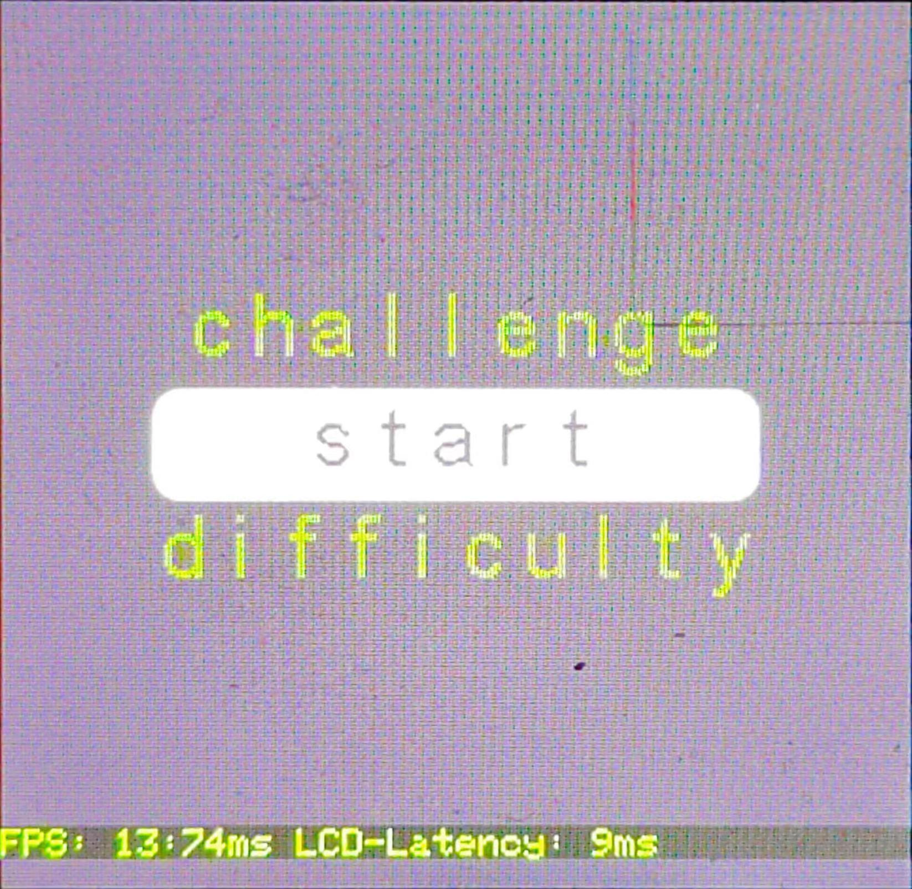
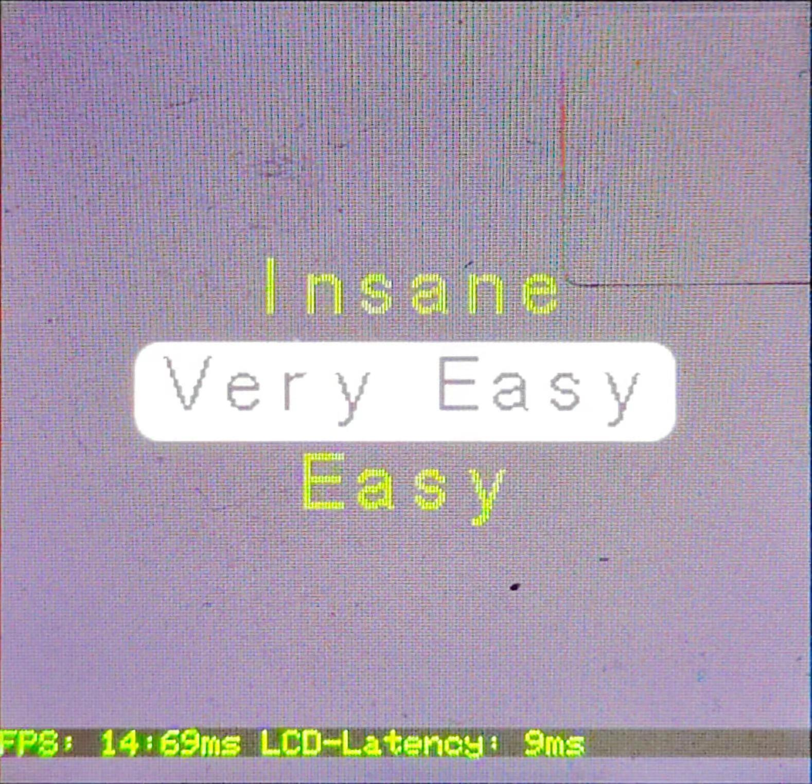
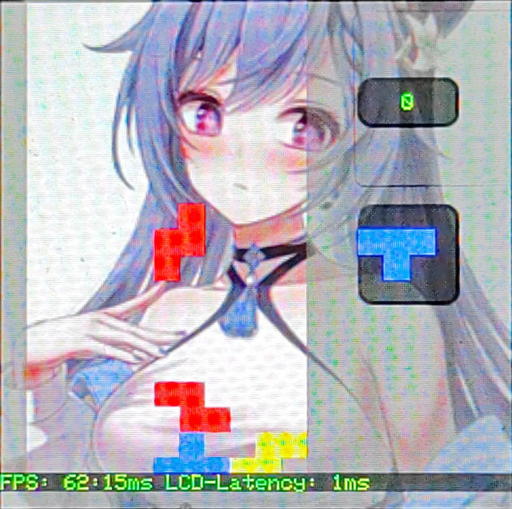

# C library usage - Tetris

- [C library usage - Tetris](#c-library-usage---tetris)
  - [Tetris](#tetris)
    - [Renderings](#renderings)
    - [Reference data](#reference-data)
      - [-Os optimization](#-os-optimization)
      - [-Oz Optimization](#-oz-optimization)
    - [Code analysis](#code-analysis)

## Tetris

Taking the tetris game as an example, we will introduce how to implement a multi-stage tetris game in the C language running environment.

### Renderings

- Start interface
   - 

- Difficulty selection
   - 

- Challenging levels
   - 

- game interface
   - 

### Reference data

#### -Os optimization

- Configuration
   - Main frequency: 80MHz
   - Optimization level: -Os -lto
   - Screen: 240 * 240
   - PFB: 240 * 4
   - Heap: 0x600
   - Stack: 0x200
   - rt heap: 0x2400

- Performance
   - Start interface:
     - Fixed refresh area: 160 * 90
     - FPS: 21:46ms
   - Difficulty selection:
     - Fixed refresh area: 160 * 90
     - FPS: 24:41ms
   - Challenge level:
     - Fixed refresh area: 30 * 66
     - FPS: 71:14ms
   - game interface:
     - FPS: 49:20ms

- Program size
   - Code = 44484
   - RO-data = 138220
     - 240x240 background image (115200), 16x24 font file, 6x8 font file, A4_DIGITS_ONLY font file
   - RW-data = 308
   - ZI-data = 18908
     - Including LCD buffer, PFB pool, rt heap, rt stack, stack, heap, tetris resource, etc.

#### -Oz Optimization

- Configuration
   - Main frequency: 80MHz
   - Optimization level: -Oz -lto
   - Screen: 240 * 240
   - PFB: 240 * 4
   - Heap: 0x600
   - Stack: 0x200
   - rt heap: 0x2400

- Performance
   - Start interface:
     - Fixed refresh area: 160 * 90
     - FPS: 19:51ms
   - Difficulty selection:
     - Fixed refresh area: 160 * 90
     - FPS: 21:46ms
   - Challenge level:
     - Fixed refresh area: 30 * 66
     - FPS: 62:16ms
   - game interface:
     - FPS: 41:24ms

- Program size
   - Code = 39248
   - RO-data = 138224
     - 240x240 background image (115200), 16x24 font file, 6x8 font file, A4_DIGITS_ONLY font file
   - RW-data = 312
   - ZI-data = 18896
     - Including LCD buffer, PFB pool, rt heap, rt stack, stack, heap, tetris resource, etc.

### Code analysis

The tetris case is divided into two C files, namely: `tnsq_tetris_draw.c` is used to draw game layers, `tnsq_tetris_logic.c` handles game logic. The following discussion is limited to drawing game layers and does not involve game mechanics.

- TinySquare provides seven basic layers, namely: background color layer, background layer, basic unit layer, user unit layer, text layer, menu layer, and number list layer

- Before drawing a layer, the display adapter needs to be initialized.
    ```c
    disp_adapter0_init();
    ```

- At the same time, apply for a stage for the interface
    ```c
    tnsq_gfx_stage_cfg_t tGameStageCFG = {
        .ptDispAdapter = {
            .ptPlayer = &DISP0_ADAPTER,
            .ptPlayerTask = disp_adapter0_task,
        },
    };

    tnsq_gfx_stage_t *ptGameStage = tnsq_gfx_stage_init(&tGameStageCFG);
    if (ptGameStage == NULL)
    {
        /* error handle */
        printf("game stage init failed\n");
        return NULL;
    }
    else
    {
        return ptGameStage;
    }
    ```

- Next draw the start interface. Two layers are needed here, one is the background color layer and the other is the menu layer.
    ```c
    arm_2d_size_t tScreenSize = tnsq_gfx_get_screen_size(&DISP0_ADAPTER);
    
    arm_2d_size_t tItemSize = {
        .iWidth = 160,
        .iHeight = 30,
    };

    rt_uint8_t chShowItemNum = 3;

    do {
        tnsq_gfx_layer_bg_cl_cfg_t tGameBGCLCFG = {
            .tType = TNSQ_GFX_BG_CL_NORMAL,
            .chOpacity = 255,
            .tRegion = {
                .tSize = tScreenSize,
            },
            .tColor = __RGB(0x6d, 0x54, 0x84),
        };
        tnsq_gfx_layer_bg_cl_t *ptGameBGCL = tnsq_gfx_layer_bg_cl_init(&tGameBGCLCFG);
        if (ptGameBGCL == NULL)
        {
            printf("menu layer init failed\n");
        }
    
        tnsq_gfx_register_layer_to_stage(ptStage, ptGameBGCL);
    } while (0);

    do {
        static const char *pchStringTable[] = {
            "start",
            "difficulty",
            "challenge"
        };
        tnsq_gfx_layer_menu_cfg_t tMenuCFG = {
            .tItemGeneral = {
                .chStringCount = sizeof(pchStringTable) >> 2,
                .pchStringTable = pchStringTable,
                .tItemSize = tItemSize,
                .chShowItemNum = chShowItemNum,
                .nFinishInMs = 150,
                .ptFont = (struct arm_2d_font_t *)&ARM_2D_FONT_16x24,
            },
            .tItemNormal = {
                .tColor = {
                    .box = __RGB(0x6d, 0x54, 0x84),
                    .font = __RGB(0x94, 0xd2, 0x52),
                },
                .chOpacity = 255,
            },
            .tItemSelected = {
                .tColor = {
                    .box = __RGB(0xff, 0xff, 0xff),
                    .font = __RGB(0x6d, 0x54, 0x84),
                },
                .chOpacity = 255,
            },
        };
    
        tnsq_gfx_layer_menu_t *ptMenuLayer = tnsq_gfx_layer_menu_init(&tMenuCFG);
        if (ptMenuLayer == NULL)
        {
            printf("menu layer init failed\n");
        }
    
        tnsq_gfx_register_layer_to_stage(ptStage, ptMenuLayer);
    } while (0);
    ```
   - For the background color layer, its area, color, and opacity are specified via `tGameBGCLCFG`. After initializing the layer, register it to the specified stage.
   - For menu layers, specify the content of the menu item through `tMenuCFG` (this is achieved through a `const char **`). Secondly, you need to specify the size of each item, upper and lower padding, switching intervals, fonts, etc. You can also customize its expression when it is selected or not.
   - When the user event is triggered, the corresponding selected item can be obtained by calling the relevant function.
     ```c
     chItemIdx = tnsq_gfx_layer_menu_get_item_idx(menuLayerSelectPtr);
     ```
- For the number list layer, initialize it as follows
    ```c
    do {
        tnsq_gfx_layer_num_cfg_t tNumCFG = {
            .chNum = 10,
            .chShowItemNum = 3,
            .nFinishInMs = 100,
            .tColor = {
                .background = __RGB(0x6d, 0x54, 0x84),
                .font = __RGB(0x94, 0xd2, 0x52),
            },
            .tPadding = {
                .pre = 3,
                .next = 3,
            },
            .ptFont = (arm_2d_font_t *)&ARM_2D_FONT_A4_DIGITS_ONLY,
        };
    
        tnsq_gfx_layer_num_t *ptNumLayer = tnsq_gfx_layer_num_init(&tNumCFG);
        if (ptNumLayer == NULL)
        {
            printf("num layer init failed\n");
        }
    
        tnsq_gfx_register_layer_to_stage(ptStage, ptNumLayer);
    } while (0);
    ```
   - Compared with the menu layer, the number layer only needs to specify the number of numbers, which is very convenient to use. Of course, the starting number and the interval between the numbers can also be specified through the `tnsq_gfx_layer_num_cfg_t` configuration item. These are left to the user to try.

- When you need to switch stages, you need to initialize a stage first. After the switch is completed, you can apply for refresh to view the effect.
    ```c
    ptStage = tetris_game_stage_init();
    
    arm_2d_scene_player_switch_to_next_scene(&DISP0_ADAPTER);

    tnsq_gfx_apply_for_refresh();
    ```

- For the initialization of the background layer, you only need to specify the corresponding resource and the corresponding Region. For information on how to convert images into resources available to the engine, please refer to [Arm-2D related introduction documents](https://github.com/ARM-software/Arm-2D/blob/main/tools/README.md)
    ```c
    tnsq_gfx_layer_bg_cfg_t tGameBCGFG = {
        .ptBackGround = &c_tilebg_tetrisRGB565,
        .ptBackGroundMask = NULL,
        .tRegion = {
            .tSize = c_tilebg_tetrisRGB565.tRegion.tSize,
        },
    };

    tnsq_gfx_layer_bg_t *ptGameBG = tnsq_gfx_layer_bg_init(&tGameBCGFG);
    if (ptGameBG == NULL)
    {
        printf("bg layer init failed\n");
    }

    tnsq_gfx_register_layer_to_stage(ptStage, ptGameBG);
    ```

- When you need to display game scores, you need to introduce a text layer. The text layer needs to specify the font, color, opacity, and corresponding Region
    ```c
    arm_2d_size_t tScreenSize = tnsq_gfx_get_screen_size(&DISP0_ADAPTER);
    
    tnsq_gfx_layer_text_cfg_t tTextCFG = {
        .chOpacity = 255,
        .ptFont = &ARM_2D_FONT_6x8.use_as__arm_2d_font_t,
        .tColour = {
            .tForeground = GLCD_COLOR_GREEN,
        },
        .tRegion = {
            .tLocation = {
                .iX = TETRIS_SCORE_Y * (tScreenSize.iWidth / TETRIS_X_COUNT),
                .iY = TETRIS_SCORE_X * (tScreenSize.iHeight / TETRIS_Y_COUNT),
            },
            .tSize = {
                .iWidth = (tScreenSize.iWidth / TETRIS_X_COUNT) * 4,
                .iHeight = (tScreenSize.iHeight / TETRIS_Y_COUNT) * 2,
            },
        }
    };

    tnsq_gfx_layer_text_t *ptGameTextLayer = tnsq_gfx_layer_text_init(&tTextCFG);
    if (ptGameTextLayer == NULL)
    {
        printf("text layer init failed\n");
    }

    tnsq_gfx_register_layer_to_stage(ptStage, ptGameTextLayer);
    ```

- The use of text layers is also very simple, just use formatted output similar to `printf`
    ```c
    tnsq_gfx_layer_text_printf(textLayerPtr, "%d", score);
    ```

- Finally take a look at the custom component layer. The user unit layer is similar to the basic unit layer, except that the user unit layer has a very flexible customization space, because the user unit layer needs to specify its own drawing function, as shown below, it only needs to be based on different `idx`, that is The corresponding content can be drawn
    ```c
    static void _tetris_user_map_func(rt_uint8_t idx, arm_2d_tile_t const *ptTile, const rt_bool_t bIsNewFrame)
    {
        arm_2d_canvas(ptTile, __user_map_canvas)
        {
            switch (idx) {
            case 0:
                arm_2dp_fill_colour_with_opacity
                (
                    NULL,
                    ptTile,
                    &__user_map_canvas,
                    (__arm_2d_color_t){GLCD_COLOR_DARK_GREY},
                    128
                );
                break;
            case 1:
                draw_round_corner_box(ptTile, &__user_map_canvas, GLCD_COLOR_BLUE, 255, bIsNewFrame);
                break;
            case 2:
                draw_round_corner_box(ptTile, &__user_map_canvas, GLCD_COLOR_GREEN, 255, bIsNewFrame);
                break;
            case 3:
                draw_round_corner_box(ptTile, &__user_map_canvas, GLCD_COLOR_CYAN, 255, bIsNewFrame);
                break;
            case 4:
                draw_round_corner_box(ptTile, &__user_map_canvas, GLCD_COLOR_RED, 255, bIsNewFrame);
                break;
            case 5:
                draw_round_corner_box(ptTile, &__user_map_canvas, GLCD_COLOR_YELLOW, 255, bIsNewFrame);
                break;
            case 6:
                draw_round_corner_box(ptTile, &__user_map_canvas, GLCD_COLOR_OLIVE, 255, bIsNewFrame);
                break;
            case 7:
                draw_round_corner_box(ptTile, &__user_map_canvas, GLCD_COLOR_PURPLE, 255, bIsNewFrame);
                break;
            default:
                draw_round_corner_box(ptTile, &__user_map_canvas, GLCD_COLOR_WHITE, 0, bIsNewFrame);
                break;
            }
        }
    }
    ```
    ```c
    tnsq_gfx_layer_user_cfg_t tInterfaceCFG = {
        .hwXCount = TETRIS_X_COUNT,
        .hwYCount = TETRIS_Y_COUNT,
        .pchUserMap = ptUserMap,
        .ptFunc = _tetris_user_map_func,
    };

    tnsq_gfx_layer_user_t *ptGameInterfaceLayer = tnsq_gfx_layer_user_init(&tInterfaceCFG);
    if (ptGameInterfaceLayer == NULL)
    {
        printf("interface layer init failed\n");
    }

    return tnsq_gfx_register_layer_to_stage(ptStage, ptGameInterfaceLayer);
    ```

- In actual use, you only need to call the corresponding API and operate the corresponding cell, and the engine will actively refresh the area.
    ```c
    tnsq_gfx_layer_user_draw(ptUserLayer, hwX, hwY, idx);
    ```

- The above is the most basic method of using each layer. The functions of more configuration items can be further explored by combining header files and related comments.