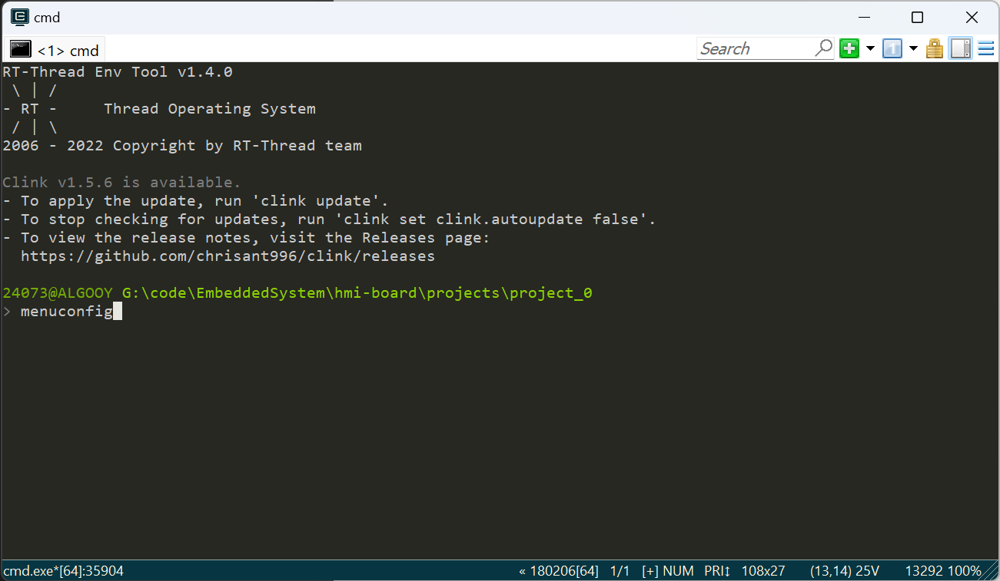
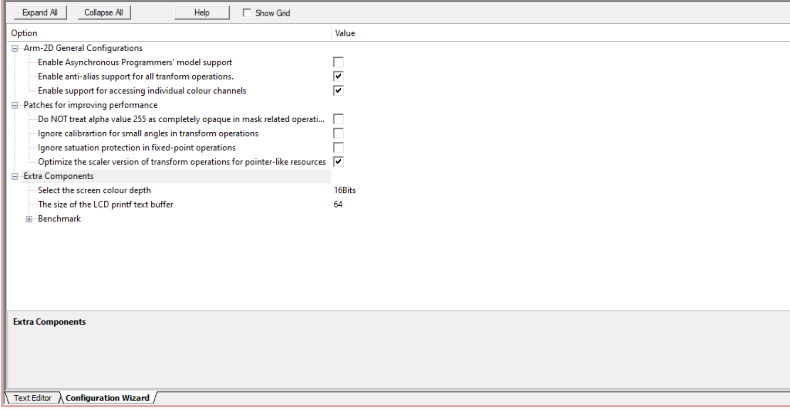
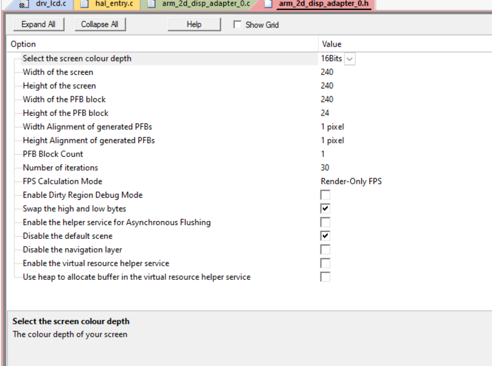

# C 库移植

- [C 库移植](#c-库移植)
  - [准备环境](#准备环境)
  - [库的移植](#库的移植)

## 准备环境

- 新建一个 RT-thread 工程

- 参照 RT-thread 官方推出的 [Env 用户手册](https://www.rt-thread.org/document/site/#/development-tools/env/env)，安装好 Env 开发工具

- 在工程目录下，打开 Env 开发工具，初始使用，可以输入 `pkgs --upgrade` 命令更新 packages
 
- 在工程目录下，输入 `menuconfig`，打开配置
  - 
  - 
- 找到 “RT-Thread online packages -> miscellaneous packages -> entertainment -> TinySquare”
  - 

- 按需勾选相应的选项，初次使用推荐勾选一个 example，这里在工程中加入贪吃蛇的 example

- 保存，退出配置

- 使用 `pkgs --update` 命令更新 packages

- 以 keil 为例，使用 scons 进行构建
  - 

## 库的移植

- 为外设配置相关的驱动

- 对于 LCD 驱动，需要实现一个绘制函数 `Disp0_DrawBitmap`，具体要求参见 [Arm-2D 库的 Preparation 章节](https://github.com/ARM-software/Arm-2D/blob/main/documentation/how_to_deploy_the_arm_2d_library.md#31-preparation)

- 打开 packages/TinySquare 路径下的 port 目录
  - 
  - 在 Keil 中打开 arm_2d_cfg.h 文件，可以编辑相关的选项（等同于直接编辑代码）
    - 
  - 同理，编辑 arm_2d_disp_adapter_0.cfg 文件
    - 
  - 想深入了解 Arm-2D 的用户，可参考其官方文档进一步学习

- 为了接受游戏事件的输入，还需配置按键驱动，需要编写一个函数，将按键事件的按下与抬起，捕获到引擎的事件处理机制中，仅需要参考 `tnsq_evt_itc_put` 函数的 API，实现相关功能即可
    ```c
    static void _pressed_high_level_key_handler(GPIO_TypeDef *GPIO_PORT, uint16_t GPIO_PIN, tnsq_evt_key_value_t tValue)
    {
        tnsq_evt_key_t tEvtKey = {0};
        GPIO_PinState state = HAL_GPIO_ReadPin(GPIO_PORT, GPIO_PIN);
        if (state != GPIO_PIN_RESET)
        {
            tEvtKey = (tnsq_evt_key_t) {
                .tKeyValue = tValue,
                .tEvent = TNSQ_EVT_KEY_EVENT_DOWN,
            };
            tnsq_evt_itc_put(&tEvtKey);
        }
        else
        {
            tEvtKey = (tnsq_evt_key_t) {
                .tKeyValue = tValue,
                .tEvent = TNSQ_EVT_KEY_EVENT_UP,
            };
            tnsq_evt_itc_put(&tEvtKey);
        }
    }
    ```

- 至此，C 环境下相关库就移植好了，只需要 `#include tiny_square.h`，调用 `arm_2d_init` 和 `tnsq_init` 函数，引擎就顺利的运行起来了
    ```c
    arm_irq_safe {
        arm_2d_init();
        tnsq_init();
    }
    ```

- 运行贪吃蛇例程
    ```c
    rt_thread_t gameTid = RT_NULL;
    gameTid = rt_thread_create("tnsq_snake", snake_task_entry, RT_NULL, THREAD_STACK_SIZE, THREAD_PRIORITY-2, THREAD_TIMESLICE);
    if (gameTid != RT_NULL) {
        rt_thread_startup(gameTid);
    }
    ```