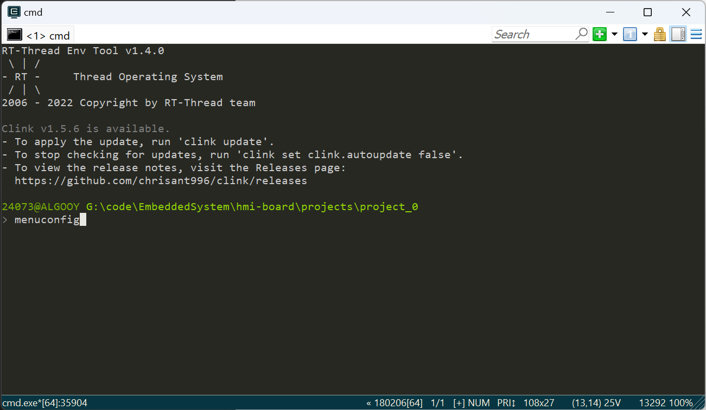
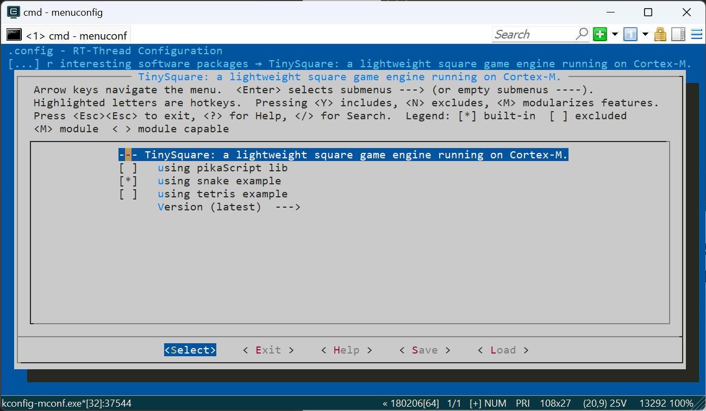
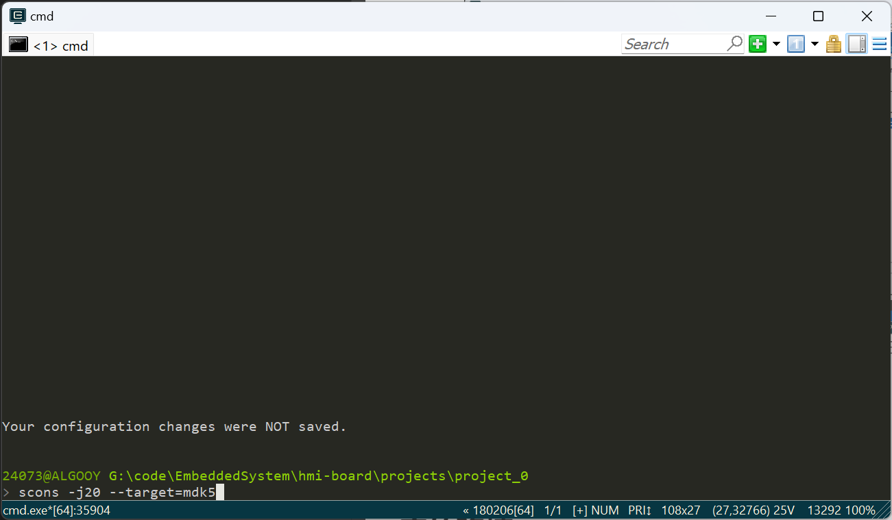
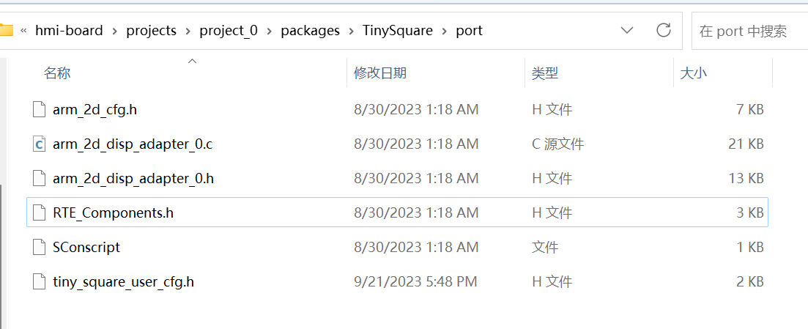
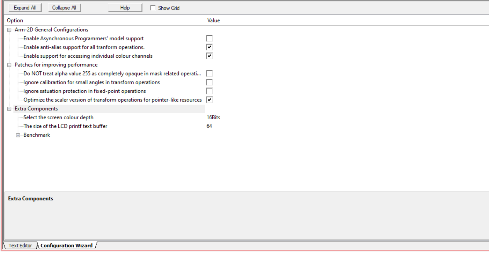
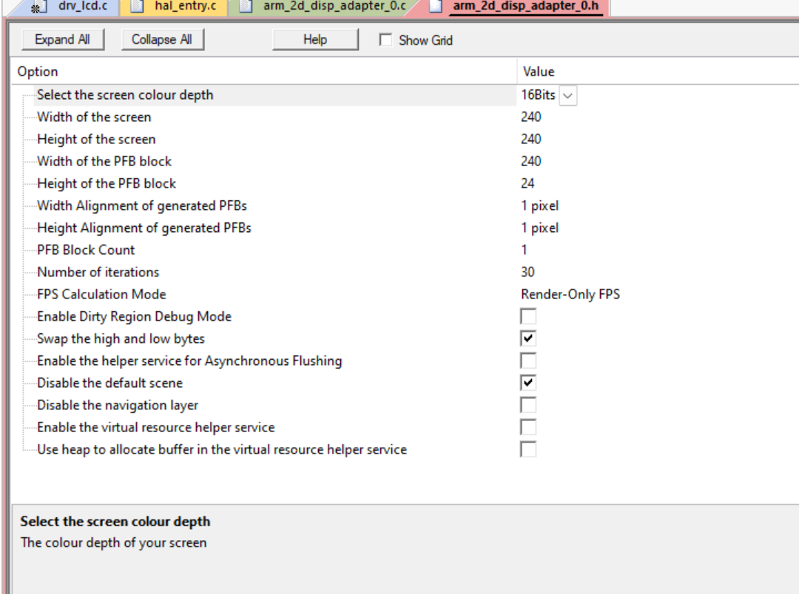

# C library porting

- [C library porting](#c-library-porting)
  - [Prepare environment](#prepare-environment)
  - [Library porting](#library-porting)

## Prepare environment

- Create a new RT-thread project

- Refer to the [Env User Manual](https://www.rt-thread.org/document/site/#/development-tools/env/env) officially launched by RT-thread to install the Env development tool

- In the project directory, open the Env development tool. For initial use, you can enter the `pkgs --upgrade` command to update packages.
 
- In the project directory, enter `menuconfig` to open the configuration
   - 
   -
- Find "RT-Thread online packages -> miscellaneous packages -> entertainment -> TinySquare"
   - 

- Check the corresponding options as needed. It is recommended to check an example for the first time. Here, add the Snake example to the project.

- Save and exit configuration

- Use `pkgs --update` command to update packages

- Take keil as an example, use scons to build
   - 

## Library porting

- Configure related drivers for peripherals

- For the LCD driver, a drawing function `Disp0_DrawBitmap` needs to be implemented. For specific requirements, please refer to the [Preparation chapter of the Arm-2D library](https://github.com/ARM-software/Arm-2D/blob/main/documentation/how_to_deploy_the_arm_2d_library.md#31-preparation)

- Open the port directory under packages/TinySquare
   - 
   - Open the arm_2d_cfg.h file in Keil and edit related options (equivalent to editing the code directly)
     - 
   - Similarly, edit the arm_2d_disp_adapter_0.cfg file
     - 
   - Users who want to learn more about Arm-2D can refer to its official documentation for further learning.

- In order to accept the input of game events, you need to configure the key driver. You need to write a function to capture the pressing and lifting of key events into the event processing mechanism of the engine. You only need to refer to the API of the `tnsq_evt_itc_put` function to implement the relevant Just function
     ```c
     static void _pressed_high_level_key_handler(GPIO_TypeDef *GPIO_PORT, uint16_t GPIO_PIN, tnsq_evt_key_value_t tValue)
     {
         tnsq_evt_key_t tEvtKey = {0};
         GPIO_PinState state = HAL_GPIO_ReadPin(GPIO_PORT, GPIO_PIN);
         if (state != GPIO_PIN_RESET)
         {
             tEvtKey = (tnsq_evt_key_t) {
                 .tKeyValue = tValue,
                 .tEvent = TNSQ_EVT_KEY_EVENT_DOWN,
             };
             tnsq_evt_itc_put(&tEvtKey);
         }
         else
         {
             tEvtKey = (tnsq_evt_key_t) {
                 .tKeyValue = tValue,
                 .tEvent = TNSQ_EVT_KEY_EVENT_UP,
             };
             tnsq_evt_itc_put(&tEvtKey);
         }
     }
     ```

- At this point, the relevant libraries in the C environment have been transplanted. You only need to `#include tiny_square.h`, call the `arm_2d_init` and `tnsq_init` functions, and the engine will run smoothly.
     ```c
     arm_irq_safe {
         arm_2d_init();
         tnsq_init();
     }
     ```

- Run the Snake routine
     ```c
     rt_thread_t gameTid = RT_NULL;
     gameTid = rt_thread_create("tnsq_snake", snake_task_entry, RT_NULL, THREAD_STACK_SIZE, THREAD_PRIORITY-2, THREAD_TIMESLICE);
     if (gameTid != RT_NULL) {
         rt_thread_startup(gameTid);
     }
     ```